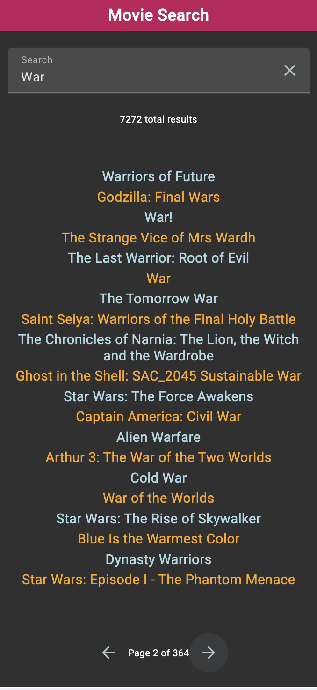
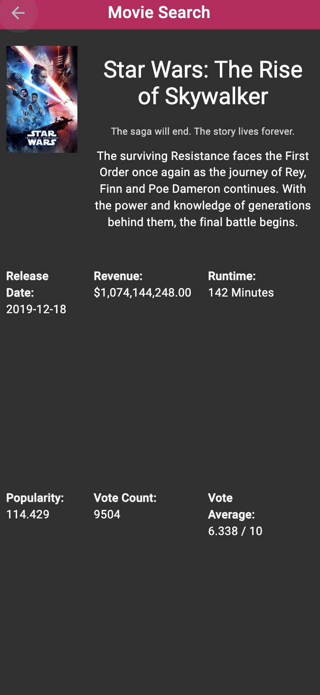
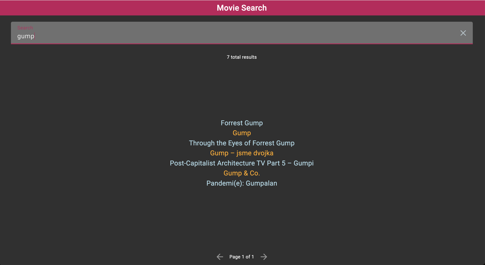
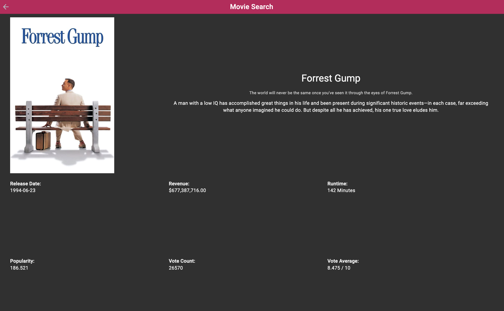

# Movie Search

A simple movie search web application

URL: https://ronancodes.github.io/movie-search/#/search

## Screenshots






## Initial Requirements

- 2 views: search (default view) and movie detail
  - Search: input and a paginated list of movies, with the ability to load another batch.
    - Search should happen once you stop typing.
  - Movie Detail: Click on movie from search page list and this view loads. It displays detailed information about the movie.
- Use the Movie DB API: https://developers.themoviedb.org/3/getting-started/introduction

## Initial setup

I chose NX instead of the default Angular application as NX provides more modern tooling along with other benefits such as caching executors, and the usage of NX Cloud with GitHub Actions.

NX provides these defaults:

- Jest (instead of Jasmine & Karma)
- Cypress for e2e
- Prettier setup

### Setup Properties

npx create-nx-workspace@latest movie-search --preset=angular-standalone

```sh
✔ Which bundler would you like to use? · esbuild
✔ Default stylesheet format · scss
✔ Do you want to enable Server-Side Rendering (SSR) and Static Site Generation (SSG/Prerendering)? · No
✔ Test runner to use for end to end (E2E) tests · cypress
✔ Set up CI with caching, distribution and test deflaking · github
```

## Angular Material

> npx nx add @angular/material

## Testing

I tested the Search Component, I skipped the Mat Input (I would have imported the NG Mat Test Harness to help here).

I did not create any real Cypress tests.

# Next pieces of work

- [] Add tests for all files
- [] Add happy flow e2e tests
- [] Add more media breakpoints for responsive design (mobile vs desktop)
- [] Add more to the detail page (more css grid, star ratings, etc)
- [] Use local storage to store last search term
- [] Add all colors to the shared stylesheet
- [] Allow light mode toggle

# NX Default Readme

<a alt="Nx logo" href="https://nx.dev" target="_blank" rel="noreferrer"></a>

✨ **This workspace has been generated by [Nx, Smart Monorepos · Fast CI.](https://nx.dev)** ✨

## Integrate with editors

Enhance your Nx experience by installing [Nx Console](https://nx.dev/nx-console) for your favorite editor. Nx Console
provides an interactive UI to view your projects, run tasks, generate code, and more! Available for VSCode, IntelliJ and
comes with a LSP for Vim users.

## Start the application

Run `npx nx serve movie-search` to start the development server. Happy coding!

## Build for production

Run `npx nx build movie-search` to build the application. The build artifacts are stored in the output directory (e.g. `dist/` or `build/`), ready to be deployed.

## Running tasks

To execute tasks with Nx use the following syntax:

```
npx nx <target> <project> <...options>
```

You can also run multiple targets:

```
npx nx run-many -t <target1> <target2>
```

..or add `-p` to filter specific projects

```
npx nx run-many -t <target1> <target2> -p <proj1> <proj2>
```

Targets can be defined in the `package.json` or `projects.json`. Learn more [in the docs](https://nx.dev/features/run-tasks).

## Set up CI!

Nx comes with local caching already built-in (check your `nx.json`). On CI you might want to go a step further.

- [Set up remote caching](https://nx.dev/features/share-your-cache)
- [Set up task distribution across multiple machines](https://nx.dev/nx-cloud/features/distribute-task-execution)
- [Learn more how to setup CI](https://nx.dev/recipes/ci)

## Explore the project graph

Run `npx nx graph` to show the graph of the workspace.
It will show tasks that you can run with Nx.

- [Learn more about Exploring the Project Graph](https://nx.dev/core-features/explore-graph)

## Connect with us!

- [Join the community](https://nx.dev/community)
- [Subscribe to the Nx Youtube Channel](https://www.youtube.com/@nxdevtools)
- [Follow us on Twitter](https://twitter.com/nxdevtools)
